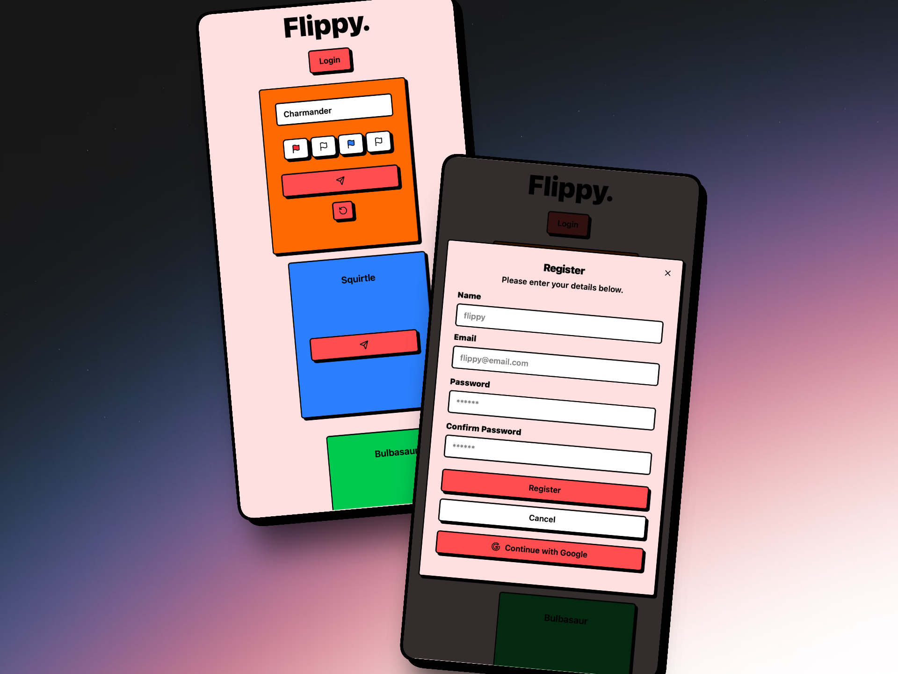

<h1 align='center'>Flippy.</h1>



<p align='center'> Minimialistic to-do-list app to get things done.</p>


<p align='center'>[Live Demo](https://flippy-eight.vercel.app)</p>

<h2>Built with</h2>

- NextJS
- React
- Typescript
- Shadcn UI
- Better-auth
- Drizzle


</br>

<h2>Features</h2>
- Simple design, where to-dos must be completed in the order in which they are set.
- Maximum of five to-dos per day, in order to reinforce keeping daily tasks simple.
- Priority colour-coding.
- Responsive design.
- Daily streaks (soon).
- Login/Profiles.


<h2>Development</h2>

Here are the steps to start the project locally.

1. Clone the repository.

```sh
HTTPS - $ git clone https://github.com/leemasdeef/flippy.git
or
SSH - $ git clone git@github.com:alex-dishen/flippy.git
```

2. Move to the cloned directory.

```sh
$ cd flippy
```

3. Install the dependencies.

```sh
$ npm i
or
$ yarn
```

4. Create <code>.env.local</code> file in the root directory for local development environment variables.

5. Connect project to Vercel via Vercel dashboard.

6. Start with pnpm dev OR npm run dev


# TO-FIX

- [x] card width increases when text is long
- [x] no text-wrapping
- [ ] pending stack disappears when clicking on completed card
- [x] register account doesnt automatically login
- [x] on successful register, no notifcation is rendered. dialog remains on register page
- [x] animation on logout
- [ ] add 5 per day card limit
- [ ] cards are not saved to users
- [ ] card background buttons dont reset toggle on card submit
- [ ] mobile breakpoints

# TO-DO

- [x] Deploy to vercel
- [x] Setup basic UI
- [x] Add card effects
- [x] Add pending card stack
- [x] Add completed card stack
- [x] Add auth w/ betterauth
- [x] Setup database
- [ ] Attach database to UI
- [x] Add form validation client-side
- [ ] Daily streak system

## UI

- [x] Add card sorting
- [ ] Add card select
- [x] Add event listeners

### Animations

- [x] Iniital card "pops" on start
- [ ] Card gets flipped to middle column when created
- [ ] Card gets flipped to end column when completed
